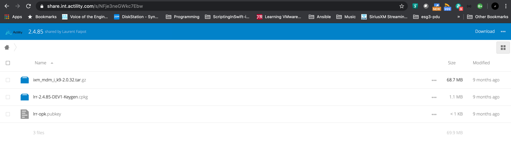

# Cisco IXM LoRaWAN Gateway Deployment


LoRaWAN Cisco Gateway

[Cisco Configuration Guide](https://www.cisco.com/c/en/us/td/docs/routers/interface-module-lorawan/software/configuration/guide/b_lora_scg/overview.html)


There are two LoRaWAN gateway modes as below:

- Virtual interface mode – IR800 series including the LoRaWAN module as a virtual interface
- Standalone mode – The LoRaWAN module working alone as an Ethernet backhaul gateway or attached to a cellular router through Ethernet

Gateways can be configured via CLI or Cisco IoT Field Network Director (IoT FND).

Workflow:

1. Prepare USB drive with Cisco firmware, LRR Package, and Public key file

   

2. Upgrade  Cisco Firmware as needed

3. Configure gateway

4. Install LRR package


---
### General Show Commands

Gateway#show ver

Gateway#show inventory
IP config validation

Gateway#show interfaces

Gateway#show ip interfaces

Gateway#show ip route

Gateway#show ip host

Gateway#show ntp status

Gateway#show ntp associations

Gateway#show ip ssh

Gateway#show ssh

Gateway#show container private-network

Gateway(config)#container log all

Container syslog has started.

Gateway#show packet-forwarder uploads [detail ]

Gateway#show packet-forwarder info

Gateway#show packet-forwarder status

Gateway#show packet-forwarder log list


#### GPS

The GPS antenna must be properly installed on the LoRaWAN interface for both LoRaWAN Class B endpoints and geolocation support.

Gateway#show aes key

Gateway#show gps log

Gateway#show gps status

Gateway#show gps history


#### FPGA
PGA version may require specific LoRaWAN forwarder version from the LoRaWAN Network Server partner.

Gateway#show fpga

Gateway#show fpga version

#### Radio

Gateway#show radio

The radio status is off by default. Please turn on radio before working with the packet forwarder. Use the following commands to turn on radio:

Gateway#configure terminal

Gateway(config)#no radio off

#### Certificate Information
Gateway#show sudi certificate 


---
### Example Configuration
```
! Gateway in Standalone mode – The LoRaWAN module working alone as an Ethernet backhaul gateway or attached to a cellular router through Ethernet
config t

hostname name

ip domain name domain_name
ip ssh authentication-retries 3

crypto key generate rsa

clock timezone America/Los_Angeles

enable secret eia!now
username admin password eia!now
! While upgrading to Release 2.0.20, admin has to reconfigure the passwords 
! for SHA512 to be effective and downgrade is not supported.

interface FastEthernet 0/1 
  description LoRaWan GW01 Backhaul to Ethernet
  ip address ip-address subnet-mask
  no shut

exit

ip default-gateway ip-address

ip name-server ip-address

ip host thinkpark.com 122.23.12.1

ntp server ip name | address address

cdp run

gps ubx enable

! Radio is off by default
no radio off

end
```


LoRaWAN packet forwarder (LRR)

LRR ID is the key information required to register a LoRaWAN Gateway on Thingpark Network Manager.


### Using Reset Button - Factory Reset

A Cisco Wireless Gateway for LoRaWAN that has already been configured can be reset to the manufacturing configuration by pressing the Reset button located at the side of the Console port on the device.

- If you press the Reset button and release it in less than 5 seconds, the system will reboot immediately with the last saved configuration.
- If you press the Reset button and release it after more than 5 seconds, the system will reboot immediately and restore to the factory default.

